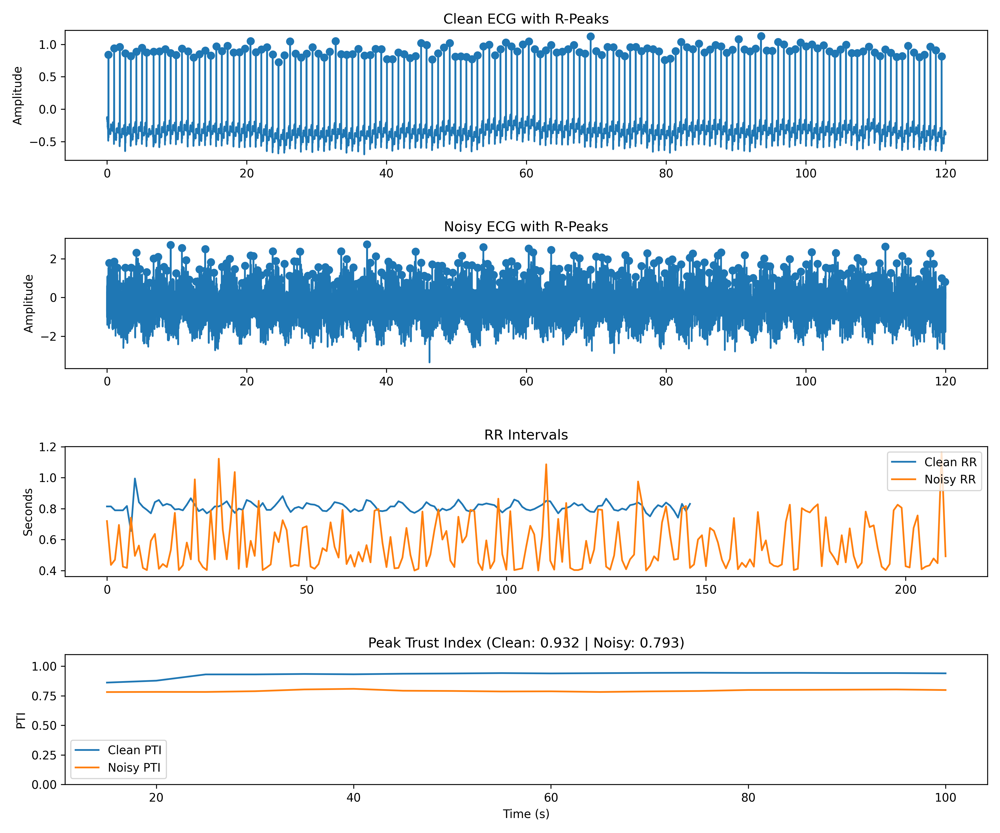

# Physiological Trust Index (PTI)
A multi-signal reliability scoring system that fuses ECG, PPG, and respiration to reduce false clinical alarms.

## Problem
Clinical monitoring systems generate high rates of false alarms due to noisy physiological signals, contributing to alarm fatigue in hospitals.
This project aims to quantify signal reliability using a fused multi-signal trust score.

## Methodology
1. Signal preprocessing (filtering, normalization)
2. Feature extraction (heart rate variability, waveform quality metrics)
3. Multi-signal fusion
4. Trust index calculation
5. Validation against clean vs noisy conditions

## Results
- Average PTI reduction under noisy conditions: 12.05%
- p-value: 5.94e-05
- Clear separation between clean and noisy signals

## Example Output

Comparison of clean and noisy ECG signals with detected R-peaks, corresponding RR intervals, and resulting Peak Trust Index (PTI).
The top panel shows a clean ECG waveform with accurately detected R-peaks.
The second panel illustrates the same signal under noisy conditions, where amplitude distortion and variability increase.
The third panel compares RR interval stability between clean and noisy signals. The noisy signal exhibits significantly higher variability due to peak detection inconsistencies.
The final panel displays the computed Peak Trust Index (PTI). The clean signal maintains a high PTI (0.932), while the noisy signal demonstrates a reduced PTI (0.789), indicating successful differentiation between reliable and degraded physiological data.

## Installation
pip install -r requirements.txt

## Run
python main.py

## Project Structure
src/        - Core processing and fusion logic
data/       - Sample datasets

## Limitations
- Tested on limited dataset
- No real-time streaming implementation yet
- Motion artifacts not fully modeled

## Future Work
- Real-time deployment
- Integration with bedside monitoring systems
- Expanded validation on larger datasets
